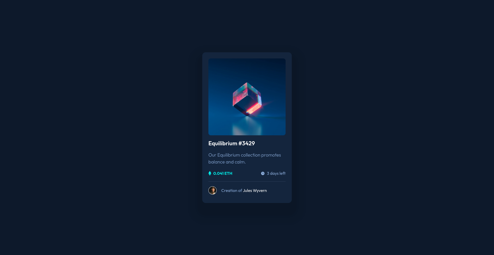

# Frontend Mentor - NFT preview card component solution

This is a solution to the [NFT preview card component challenge on Frontend Mentor](https://www.frontendmentor.io/challenges/nft-preview-card-component-SbdUL_w0U).

## Table of contents

- [Overview](#overview)
  - [The challenge](#the-challenge)
  - [Screenshot](#screenshot)
  - [Links](#links)
- [My process](#my-process)
  - [Built with](#built-with)
  - [What I learned](#what-i-learned)
  - [Continued development](#continued-development)
  - [Useful resources](#useful-resources)
- [Author](#author)

## Overview

### The challenge

Users are able to:

- ✔️ View the optimal layout depending on their device's screen size
- ✔️ See hover states for interactive elements

### Screenshot



### Links

- [Solution](https://your-solution-url.com)
- [Live Site](https://fm-nft-preview-card-component-lime.vercel.app/)

## My process

### Built with

- Semantic HTML5 markup
- Flexbox
- Mobile-first workflow
- [Tailwindcss](https://tailwindcss.com/)
- [React](https://reactjs.org/) - JS library
- [Vite](https://vitejs.dev/) - Build tool

### What I learned

I used the `tailwind.config.js` file to create a custom double shadow for the card:
```js
export default {
  theme: {
    extend: {
      boxShadow: {
        "card": "0 30px 5px 20px rgb(0, 0, 0, 0.06), 0 30px 5px 50px rgb(0, 0, 0, 0.03)",
      },
    },
  },
};
```

### Continued development

- Nuxt > Next

### Useful resources

- [React docs](https://react.dev/reference/react)
- [Cool Tailwind video](https://www.youtube.com/watch?v=pfaSUYaSgRo)
- The Mozilla references for [HTML](https://developer.mozilla.org/en-US/docs/Web/HTML) and [CSS](https://developer.mozilla.org/en-US/docs/Web/CSS) are always useful.

## Author

- LeetCode - [@SerbanUntu](https://leetcode.com/SerbanUntu/)
- Github - [@SerbanUntu](https://github.com/SerbanUntu)
- Frontend Mentor - [@SerbanUntu](https://www.frontendmentor.io/profile/SerbanUntu)